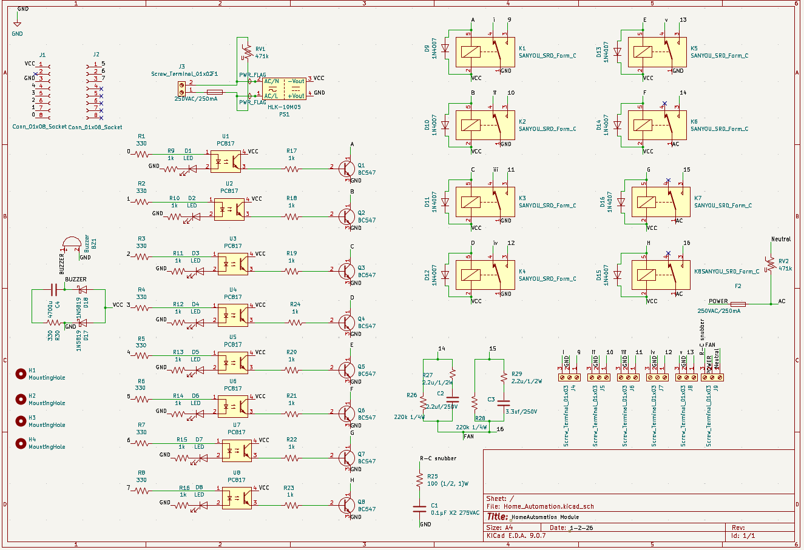

# 🏠 Home Automation Control Module (PCB Based)

## 📌 Project Overview

This project is a **PCB-based Home Automation Control Module** designed to control multiple AC appliances safely using relay isolation. The system uses optocouplers for electrical isolation, transistor drivers for relay switching, and an onboard AC-to-DC power module to power the control circuit.

The module can be controlled using:

* Microcontroller (ESP8266, Arduino, etc.)
* External digital logic
* Smartphone-based IoT system
* Manual control system

This design ensures **safety, reliability, and industrial-level performance**.

---

## ✨ Features

* Control up to **8 AC appliances**
* **Complete electrical isolation** using PC817 optocouplers
* **Onboard AC-DC converter (HLK-10M05)** – no external power supply required
* **Relay driver circuit using BC547 transistors**
* **Flyback diode protection** for relays
* **Status LEDs for each channel**
* **RC snubber for noise protection**
* **Compact and optimized PCB layout**
* Suitable for:

  * Home automation
  * Industrial automation
  * IoT systems
  * Smart switchboards

---

## 🔧 Hardware Components

| Component                             | Quantity |
| ------------------------------------- | -------- |
| HLK-10M05 AC-DC Module                | 1        |
| Relay (5V)                            | 8        |
| PC817 Optocoupler                     | 8        |
| BC547 Transistor                      | 8        |
| 1N4007 Diode                          | 8+       |
| LEDs                                  | 8        |
| Resistors (330Ω, 1kΩ, 220kΩ, etc.)    | Multiple |
| Capacitors (Electrolytic and Ceramic) | Multiple |
| Screw Terminals                       | Multiple |
| Buzzer                                | 1        |
| MOV (optional safety)                 | 1        |

---

## ⚡ Power Supply

**Input:**

* 230V AC mains

**Output:**

* 5V DC (from HLK-10M05)

Used to power:

* Optocouplers
* Relay coils
* Logic circuit

---

## 🔌 Pin Configuration

### Input Control Header

| Pin | Function        |
| --- | --------------- |
| IN1 | Relay 1 control |
| IN2 | Relay 2 control |
| IN3 | Relay 3 control |
| IN4 | Relay 4 control |
| IN5 | Relay 5 control |
| IN6 | Relay 6 control |
| IN7 | Relay 7 control |
| IN8 | Relay 8 control |
| VCC | 5V              |
| GND | Ground          |

---

## 🔄 Working Principle

1. Control signal applied to input pin
2. Optocoupler provides isolation
3. Transistor amplifies signal
4. Relay activates
5. Appliance turns ON/OFF

Isolation ensures protection from high voltage.

---

## 📷 Schematic



---

## 🧩| Full Layout | Upper Copper |


---

## 🔷 PCB 3D View


---

## 🛡️ Safety Features

* Optocoupler isolation
* Flyback diode protection
* RC snubber protection
* Proper PCB trace width for AC
* Separate AC and DC sections
* Fuse protection support

---

## 🌐 Applications

* Smart Home Automation
* IoT Control Systems
* Industrial Automation
* Remote Appliance Control
* Smart Switchboard

---

## 🧠 Compatible Controllers

* ESP8266
* ESP32
* Arduino Uno / Nano
* Raspberry Pi
* Any microcontroller with GPIO output

---

## 📁 Project Structure

```
Home-Automation-PCB/
│
├── KiCAD/
│   └── home_automation.kicad_pcb
│   └── home_automation.kicad_sch
│   └── home_automation.kicad_prl
│   └── home_automation.kicad_pro
│   └── home_automation.dsn
│ 
├── images/
│   ├── schematic.png
│   └── pcb_layout.png
|   └── 3D_View.png
|   └── Upper_Copper.png
│
├── gerber/
│   └── production files
|
├── gerber/Drill
│   └── production files
│
└── README.md
```

---

## 🚀 How to Use

1. Connect AC mains input
2. Connect appliances to relay terminals
3. Connect microcontroller to input header
4. Apply control signal
5. Appliance will turn ON/OFF

---

## ⚠️ Warning

This project uses **HIGH VOLTAGE AC**.

* Do not touch while powered
* Use proper insulation
* Use fuse and enclosure
* Only trained persons should handle

---

## 📌 Author

**Project by:** Gaming_Tube
**Designed using:** KiCad
**Type:** Home Automation PCB Module

---
